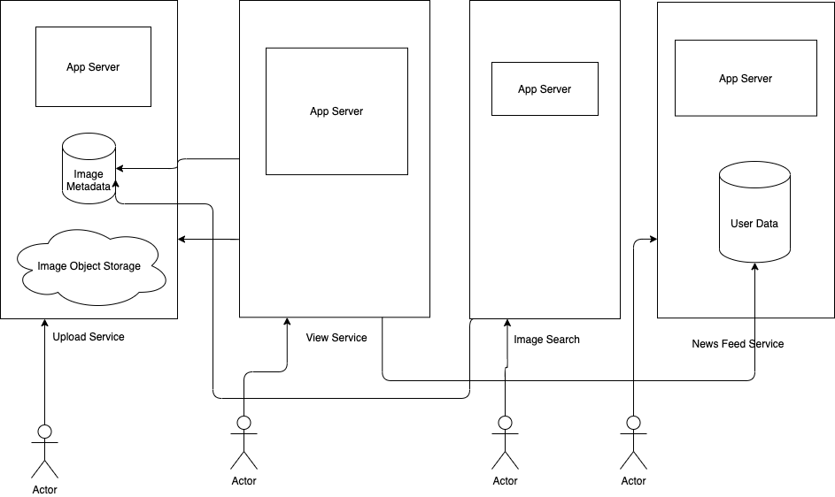

# Requirements
- User upload photos
- User share photos
    - Choose to share public
        - Shared content will be viewed by any users
    - Choose to share privately 
        - Shared content can only be viewed by specific users 
- Share using Facebook/Twitter/Flicker/Tumblr etc
# Minimum Requirements and Goal of the system
## Functional Requirements 
- User should be able to upload/download/view photos
- User can performs searches based on photo title
- User follow other users 
- User can share photos
    - Choose to share public
        - Shared content will be viewed by any users
    - Choose to share privately 
        - Shared content can only be viewed by specific users 
- The system should generate and display a user's news feed consisting of top photos from all the people the user follows 
## Non functional requirements
- Service needs to be highly available
- The acceptable latency of system is 200ms for News Feed generation
- Consistencies can take a hit (in the interest of availability) if a user doesn't see a photo for a while; it should be fine
- System should be highly reliable, any uploaded photo or video should never be lost. 
## Not in scope
- Adding tags to photo
- searching photo on tags
- commenting on photo
- tagging users to photo
- who to follow etc
- Upload video
# Design considerations
The system would be read heavy, so we will focus on building a system that can retrieve photos quickly
- A user should be able to upload as many photos as they like. Therefore storage management should be crucial factor.
- Low latency is expected while view photo
- Data should be 100% reliable. If a user upload photo, system will guarantee that it will never be lost
# Volume constraints
- Total users: 500 millions
- Daily active users: 1 millions
- Daily new photo upload per user: 2 
    - Daily new photos: 2 millions
    - New photo every seconds: 23

# High level system design
Following are proposed micro services 
- User registration service
- Upload photo service
- View photo service 
- Search photo service 
- User follower service
- News feed service


# API Design
## Create User
```
POST /users?apiKey
{
    username
    email
    dateOfBirth
    password: string
}
```
Following will be schema to store user details
```
{
    userId: int
    username: string
    email: string
    dateOfBirth: DateTime
    createdAt: DateTime
    updatedAt: DateTime
    lastLoggedIn: DateTime
    password: string
}
```
## Upload Photo
```
POST /upload/photo??apiKey&authToken=string multipart
filename
filecontent
```
Response:
```
{
    url: https://cdn.insta.com/static/photo/34252wwertwertwert,
    photoId: 34252wwertwertwert
    filename: "home.png"
}
```
Following should be schema to store photo details in NoSQL Database
```
{
    photoId: int
    photoLat: int
    photoLang: int
    createdAt: DateTime
}
```
Following will be schema to store photo and user ownership mapping
```
{
    photoId: sha256
    userId: int
    createdAt: DateTime
    updatedAt: DateTime  
    public: boolean  
    limited: boolean
    owner: boolean 
}
```

## Share photo
```
POST /photos/234234/share?apiKey&authToken=string
{
    users: [23423,2345,345456]
}
```
Following is the schema to store photo sharing permission in database
```
{
    photoId: int
    userId: int
    createdAt: DateTime
    updatedAt: DateTime  
    public: boolean  
    limited: boolean
    owner: boolean 
}
```
## User follow
```
POST /users/12324?apiKey&authToken=string
{
    userId: 23235
}
```
Following is schema to store user and followers
```
{
    userId: int
    followUserId: int
}
```
## Get user's feed
```
GET /users/12324?apiKey&authToken=string&since=datetime&count=int
```
# ID generation service
Following are different approach 
## Random number
Major drawback is high number of collision
## Hashing
- sha256 - 64 digits
Disadvantage
- Long id
- Only feasible if needs deterministic id (username or username + photo)
## Timestamp + Random number + host
Disadvantage:
- Chances of collision if host id is not included
## Using database auto sequence (MySQL, Oracle etc)
- Single database so not fault tolerance 
Q. How to take care of fault tolerance?
Ans: 
- Have two database
    - One will generate odd sequence and second will generate even
    - Load balancer will distribute traffic to these two database
    - If one db is down then load balancer will send to active db
- Have n database
Disadvantage:
    - Write will be slow for high traffic
## Better approach using database
- Pre-generate the block of ids
- On server restart, load these block of ids
## Hybrid approach to use timestamp + seq 
- Generate sequence number using optimized database approach 
- prepend timestamp with sequence to generate id
Benefits:
- sort by id which gives sort by time
Note: we will go with this approach
# Scale App Server
- Total users: 500 millions
- Daily active users: 1 millions
    - Concurrent users: 20 % of active users ~ 200k
    - max concurrent connection per server: 500
    - Number of app servers: 400
- Daily new photos: 2 millions
    - New photo every seconds: 23
    - Concurrent users: 20 % of active users ~ 200k
    - Max concurrent request: 23 * 200k ~ 4600k
    - max concurrent connection per server: 500
    - Number of app servers: 9200    
# Storage Details
Following are proposed storage system 
## NoSQL Storage for Photo Metadata
```
{
    photoId: int (4 bytes)
    title: string (256 bytes)
    mimeType: string (256 bytes)
    path: string (256 bytes)
    photoLat: int (4 bytes)
    photoLang: int (4 bytes)
    createdAt: DateTime(8 bytes)
    updatedAt: DateTime(8 bytes)
    userId: int (4 bytes)
    public: boolean (2 bytes)
    likes: int (4 bytes)
}
```
- Size for each document
    - NoSQL stores each key and data types as well: 11 * 4 bytes
    - Index on photoId: 4 bytes
    - Index on userId: 4 bytes
    - Other overhead: 15 bytes
    - Total size: 804 bytes + 44 bytes + 8 byte +15 bytes ~ 877 bytes ~ 1kb
- Daily new photos: 2 millions
    - Total size: 2 millions * 1 kb ~ 2 GB
- In 10 years: 2GB * 365 * 10 =  7.3 TB
### Data Sharding
    - photoId as shard key
    - Limit per shard: 1TB
    - Total shards: ~3 
    - Keep 3 replicas in each shards to handle failover 
    - Total storage: 9TB
    - Do write on majority i.e. compromise on consistencies and use eventual consistencies. 
    - I.e in CAP, use AP system 
## NoSQL Storage for User Data
```
{
    userId: int (4 bytes)
    username: string (32 bytes)
    email: string (32 bytes)
    dateOfBirth: DateTime (8 bytes)
    createdAt: DateTime (8 bytes)
    updatedAt: DateTime (8 bytes)
    lastLoggedIn: DateTime (4 bytes)
    password: string (4 bytes)
}
```
- Size for each document:
    - NoSQL stores each key and data types as well: 8 * 4 bytes ~32 bytes
    - Index on userId: 4 bytes
    - Other overhead: 15 bytes
    - Total size: 100 bytes + 32 bytes + 4 bytes +15 bytes ~ 151 bytes ~ 160 bytes
- Total users: 500 millions
    - Total storage: 500 millions * 160bytes ~ 80GB
### Data Sharding
    - Use userId as shard key
    - Limit per shard: 1TB
    - Total shards: ~1
    - Keep 3 replicas in each shards to handle failover 
    - Total storage: 3TB
    - Do write on majority i.e. compromise on consistencies and use eventual consistencies. 
    - I.e in CAP, use AP system     
## NoSQL Storage for User follower Data
```
{
    userId: int (4 bytes)
    followerUserId: int (4bytes)
}
```
- Size of each document:
    - NoSQL stores each key and data types as well: 2 * 4 bytes ~8 bytes
    - Index on userId: 4 bytes
    - Index on followerUserId: 4 bytes
    - Other overhead: 15 bytes
    - Total size: 8 bytes + 8 bytes + 8 bytes +15 bytes ~ 39 bytes ~ 40 bytes
- Total users: 500 millions
    - 20% users follow each other: 100 millions
    - Total storage: 100 millions * 40bytes ~ 4GB
### Data Sharding
    - use userId as shard key
    - Limit per shard: 1TB
    - Total shards: ~1
    - Keep 3 replicas in each shards to handle failover 
    - Total storage: 3TB
    - Do write on majority i.e. compromise on consistencies and use eventual consistencies. 
    - I.e in CAP, use AP system      
## NoSQL Storage for Shared Photo Data
```
{
    photoId: int (4 bytes)
    userId: int (4 bytes)
    createdAt: DateTime (8 bytes)
    updatedAt: DateTime  (8 bytes)
}
```
- Size of document:
    - NoSQL stores each key and data types as well: 4 * 4 bytes ~16 bytes
    - Index on userId: 4 bytes
    - Index on photoId: 4 bytes
    - Other overhead: 15 bytes
    - Total size: 24 bytes + 16 bytes + 8 bytes +15 bytes ~ 63 bytes
- Daily new photos: 2 million
- 20% photo shared: 0.20 * 2 million = 400k
- Total users: 500 millions
- Each photo on avg shared with 5 people
- Total photos and users mapping daily: 400k * 5 = 2 million
- Total size daily: 2 million  * 63 bytes = 126 mb
- Total size in 10 years: 365 * 10 * 126mb ~ 460GB
### Data Sharding
    - use photoId as shard key
    - Limit per shard: 1TB
    - Total shards: ~1
    - Keep 3 replicas in each shards to handle failover 
    - Total storage: 3TB
    - Do write on majority i.e. compromise on consistencies and use eventual consistencies. 
    - I.e in CAP, use AP system  
## Object Storage for photo file content
- Total users: 500 millions
- Daily active users: 1 millions
- Daily new photos: 2 millions
    - New photo every seconds: 23
- Avg photo file size: 200KB
- Total space required for 1 day of photos: 2 millions * 200KB = 400GB
- Total space required for 10 years: 365 * 10 * 4000GB = 1,460TB
### Data Sharding
    - use photoId as shard key
    - Limit per shard: 1TB
    - Total shards: 1460 ~1500
    - Keep 3 replicas in each shards to handle failover 
    - Do write on majority i.e. compromise on consistencies and use eventual consistencies. 
    - I.e in CAP, use AP system  
# Photo permission 
- For given valid user auth token retrieve userId
- Check the user and photo permission
    - Check ownership relationship of user from Photo collection
    - if owner then allow to view
    - if publicly shared then allow to view
    - if not then check if this photo is shared with given user
    - if shared then allow access
- Otherwise return 403 http error code i.e. forbidden
# User timeline service
## Feed generation
- retrieve  all userIds given user follows
- Retrieve latest, most popular, and relevant photos for followed userIds. These are potential photos can be shown to user
- Rank these photos based on relevance to user. This represent user's current feed
- Store this feed in the cache and return top photos (say 20) to be rendered on user's timeline
- Frontend can make paginated api call to fetch next `20` photos
Q. How to update new incoming photos from people user follow?
A: 
- If user is online, we should have mechanism to rank and add the newer photos to her feed. 
- We can periodically (say every 5 minutes) perform the above steps to rank and add the newer photos to user's feed.
- User can be notified about new feed

## Feed publishing
- Whenever user loads her newsfeed page, she has to request and pull feed items from the server. 
- When she reaches the end of her current feed, she can pull more data from the server. 
- For newer items either the server can notify user and then she can pull, or the server can push, these new photos. 
## Problem with run time feed generation
- Crazy slow for users with a lot of follows as we have to perform sorting/merging/ranking of a huge number of photos.
- We generate the timeline when a user loads their page. This would be quite slow and have a high latency.
- For live updates, each status update will result in feed updates for all followers. This could result in high backlogs in our Newsfeed Generation Service.
- For live updates, the server pushing (or notifying about) newer photos to users could lead to very heavy loads, especially for people or pages that have a lot of followers. 
## Offline generation for newsfeed
### Steps to generate offline news feed
- We can have dedicated servers that are continuously generating user's newsfeed and storing them in memory. 
- So, whenever a user requests for the new photos for their feed, we can simply serve it from the pre-generated, stored location. 
- Using this scheme, user’s newsfeed is not compiled on load, but rather on a regular basis and returned to users whenever they request for it.
- Whenever these servers need to generate the feed for a user, they will first query to see what was the last time the feed was generated for that user. 
- Then, new feed data would be generated from that time onwards. 
- We can store this data in a hash table where the “key” would be UserID and “value” would be a STRUCT like this:
```
Struct {
    LinkedHashMap<FeedItemID, FeedItem> feedItems;
    DateTime lastGenerated;
}
```
- We can store FeedItemIDs in a data structure similar to `Linked HashMap` or `TreeMap`, which can allow us to not only jump to any feed item but also iterate through the map easily. 
- Whenever users want to fetch more feed items, they can send the last FeedItemID they currently see in their newsfeed, we can then jump to that FeedItemID in our hash-map and return next batch/page of feed items from there.
### How many feed items should we store in memory for a user’s feed?
- Initially, we can decide to store 500 feed items per user, but this number can be adjusted later based on the usage pattern. 
- For example, if we assume that one page of a user’s feed has 20 photos and most of the users never browse more than ten pages of their feed, we can decide to store only 200 photos per user. 
- For any user who wants to see more photos (more than what is stored in memory), we can always query backend servers.
### Should we generate (and keep in memory) newsfeeds for all users?
- There will be a lot of users that don’t log-in frequently. 
- Here are a few things we can do to handle this; 
    - a more straightforward approach could be, to use an LRU based cache that can remove users from memory that haven’t accessed their newsfeed for a long time 
    - a smarter solution can figure out the login pattern of users to pre-generate their newsfeed, e.g., at what time of the day a user is active and which days of the week does a user access their newsfeed? etc.
## Optimized feed publishing
### "Pull" model:
- This method involves keeping all the recent feed data in memory so that users can pull it from the server whenever they need it. 
- Clients can pull the feed data on a regular basis or manually whenever they need it. 
- Possible problems with this approach are 
    - New data might not be shown to the users until they issue a pull request
    - It’s hard to find the right pull cadence, as most of the time pull requests will result in an empty response if there is no new data, causing waste of resources.
### "Push" model:
- For a push system, once a user has published a post, we can immediately push this post to all the followers. 
- The advantage is that when fetching feed you don’t need to go through your friend’s list and get feeds for each of them. 
- It significantly reduces read operations. 
- To efficiently handle this, users have to maintain a Long Poll request with the server for receiving the updates. 
- A possible problem with this approach is that when a user has millions of followers (a celebrity-user) the server has to push updates to a lot of people.
### Hybrid
- An alternate method to handle feed data could be to use a hybrid approach, i.e., to do a combination of pull and push. 
- Specifically, we can stop pushing photos from users with a high number of followers (a celebrity user) and only push data for those users who have a few hundred (or thousand) followers. 
- For celebrity users, we can let the followers pull the updates. 
- Since the push operation can be extremely costly for users who have a lot of friends or followers, by disabling push for them, we can save a huge number of resources. 
- Another alternate approach could be that, once a user publishes a post, we can limit the push to only her online friends. 
- Also, to get benefits from both the approaches, a combination of ‘push to notify’ and ‘pull for serving’ end-users is a great way to go. Purely a push or pull model is less versatile.

## Feed ranking
- The most straightforward way to rank photos in a newsfeed is by the creation time of the photos, but today’s ranking algorithms are doing a lot more than that to ensure “important” photos are ranked higher. 
- The high-level idea of ranking is first to select key “signals” that make a post important and then to find out how to combine them to calculate a final ranking score.
- More specifically, we can select features that are relevant to the importance of any feed item, e.g., number of likes, comments, shares, time of the update etc., and then, a score can be calculated using these features. 
- This is generally enough for a simple ranking system. 
- A better ranking system can significantly improve itself by constantly evaluating if we are making progress in user stickiness, retention, ads revenue, etc.
