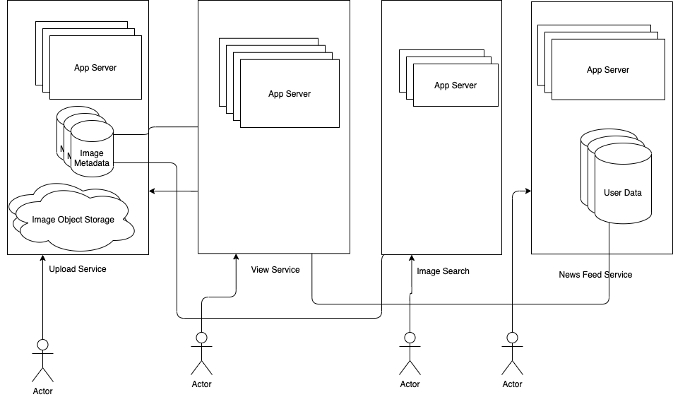

# Requirements
- User upload photos
- User share photos
    - Choose to share public
        - Shared content will be viewed by any users
    - Choose to share privately 
        - Shared content can only be viewed by specific users 
- Share using Facebook/Twitter/Flicker/Tumblr etc
# Minimum Requirements and Goal of the system
## Functional Requirements 
- User should be able to upload/download/view photos
- User can performs searches based on photo title
- User follow other users 
- User can share photos
    - Choose to share public
        - Shared content will be viewed by any users
    - Choose to share privately 
        - Shared content can only be viewed by specific users 
- The system should generate and display a user's news feed consisting of top photos from all the people the user follows 
## Non functional requirements
- Service needs to be highly available
- The acceptable latency of system is 200ms for News Feed generation
- Consistencies can take a hit (in the interest of availability) if a user doesn't see a photo for a while; it should be fine
- System should be highly reliable, any uploaded photo or video should never be lost. 
## Not in scope
- Adding tags to photo
- searching photo on tags
- commenting on photo
- tagging users to photo
- who to follow etc
- Upload video
# Design considerations
The system would be ready heavy, so we will focus on building a system that can retrieve photos quickly
- A user should be able to upload as many photos as they like. Therefore storage management should be crucial factor.
- Low latency is expected while view photo
- Data should be 100% reliable. If a user upload photo, system will guarantee that it will never be lost
# Capacity estimation and constraints
- Total users: 500 millions
- Daily active users: 1 millions
- Daily new photos: 2 millions
    - New photo every seconds: 23

# High level system design to solve single user flow
Following are proposed micro services 
- Upload photo service
- View photo service 
- Search photo service 
- News feed service
- User registration service
- User follower service


# API Design
## Create User
```
POST /users
{
    username
    email
    dateOfBirth
    password: string
}
```
Following will be schema to store user details
```
{
    username: string
    email: string
    dateOfBirth: DateTime
    createdAt: DateTime
    updatedAt: DateTime
    lastLoggedIn: DateTime
    password: string
}
```
## Upload Photo
```
POST /upload/photo  multipart
authtoken
filename
filecontent
```
Response:
```
{
    url: https://cdn.insta.com/static/photo/34252wwertwertwert,
    photoId: 34252wwertwertwert
    filename: "home.png"
}
```
Following should be schema to store photo details in NoSQL Database
```
{
    photoId: sha256
    photoLat: int
    photoLang: int
    createdAt: DateTime
}
```
Following will be schema to store photo and user ownership mapping
```
{
    photoId: sha256
    userId: sha256
    createdAt: DateTime
    updatedAt: DateTime  
    public: boolean  
    limited: boolean
    owner: boolean 
}
```
### How to generate photo id?
```
sha256(photo_content)
```
## Share photo
```
POST /photos/234234/share
{
    users: [23423,2345,345456]
}
```
Following is the same schema to store photo sharing permission in database
```
{
    photoId: sha256
    userId: sha256
    createdAt: DateTime
    updatedAt: DateTime  
    public: boolean  
    limited: boolean
    owner: boolean 
}
```
## User follow
```
POST /users/12324
{
    userId: 23235
}
```
Following is schema to store user and followers
```
{
    userId: sha256
    followerUserId: sha256
}
```
# Scale App Server
- Total users: 500 millions
- Daily active users: 1 millions
    - Concurrent users: 20 % of active users ~ 200k
    - max concurrent connection per server: 500
    - Number of app servers: 400
- Daily new photos: 2 millions
    - New photo every seconds: 23
    - Concurrent users: 20 % of active users ~ 200k
    - Max concurrent request: 23 * 200k ~ 4600k
    - max concurrent connection per server: 500
    - Number of app servers: 9200    
# Storage Details
Following are proposed storage system 
## NoSQL Storage for Photo Metadata
```
{
    photoId: sha256 (32 bytes)
    photoLat: int (4 bytes)
    photoLang: int (4 bytes)
    createdAt: DateTime(8 bytes)
}
```
- Size for each document: 48 bytes + 16 bytes ~ 64 bytes
    - NoSQL stores each key and data types as well
    - Index also use disk storage
    - Keep size as 1kb to estimate on higher side
- Daily new photos: 2 millions
    - Total size: 2 millions * 1 kb ~ 2GB
- In 10 years: 2GB * 365 * 10 =  7.3 TB
### Data Sharding
    - Limit per shard: 1TB
    - Total shards: ~8 
    - Keep 3 replicas in each shards to handle failover 
    - Do write on majority i.e. compromise on consistencies and use eventual consistencies. 
    - I.e in CAP, use AP system 
## NoSQL Storage for User Data
```
{
    userId: sha256 (32 bytes)
    username: string (32 bytes)
    email: string (32 bytes)
    dateOfBirth: DateTime (8 bytes)
    createdAt: DateTime (8 bytes)
    updatedAt: DateTime (8 bytes)
    lastLoggedIn: DateTime (4 bytes)
    password: string (4 bytes)
}
```
- Size for each document: 120 bytes + 32 bytes ~ 152 bytes
    - NoSQL stores each key and data types as well
    - Index also use disk storage
    - Keep size as 1kb to estimate on higher side
- Total users: 500 millions
    - Total storage: 500 millions * 1kb ~ 500GB
### Data Sharding
    - Use photoId as shard key
    - Limit per shard: 1TB
    - Total shards: ~1
    - Keep 3 replicas in each shards to handle failover 
    - Do write on majority i.e. compromise on consistencies and use eventual consistencies. 
    - I.e in CAP, use AP system     
## NoSQL Storage for User follower Data
```
{
    userId: sha256 (32 bytes)
    followerUserId: sha256 (bytes)
}
```
- Size for each document: 64 bytes + 8 bytes ~ 72 bytes
    - NoSQL stores each key and data types as well
    - Index also use disk storage
    - Keep size as 1kb to estimate on higher side
- Total users: 500 millions
    - 20% users follow each other: 100 millions
    - Total storage: 100 millions * 1kb ~ 100GB
### Data Sharding
    - use userId as shard key
    - Limit per shard: 1TB
    - Total shards: ~1
    - Keep 3 replicas in each shards to handle failover 
    - Do write on majority i.e. compromise on consistencies and use eventual consistencies. 
    - I.e in CAP, use AP system      
## NoSQL Storage for Photo and User Data
```
{
    photoId: sha256 (32 bytes)
    userId: sha256 (32 bytes)
    createdAt: DateTime (8 bytes)
    updatedAt: DateTime  (8 bytes)
    public: boolean  (8 bytes)
    limited: boolean (2 bytes)
    owner: boolean  (2 bytes)
}
```
- Size of document: 92 bytes + 28 bytes ~ 110bytes
    - NoSQL stores each key and data types as well
    - Index also use disk storage
    - Keep size as 1kb to estimate on higher side
- Daily new photos: 2 millions
- Total users: 500 millions
- 20% photo shared: 400k
- Total photos and users mapping daily: 2.4 million
- Total size daily: 2.4 million  * 1kb = 2.4GB
- Total size in 10 years: 365 * 10 * 2.4GB ~ 17.520TB
### Data Sharding
    - use photoId as shard key
    - Limit per shard: 1TB
    - Total shards: ~18
    - Keep 3 replicas in each shards to handle failover 
    - Do write on majority i.e. compromise on consistencies and use eventual consistencies. 
    - I.e in CAP, use AP system  
## Object Storage for photo file content
- Total users: 500 millions
- Daily active users: 1 millions
- Daily new photos: 2 millions
    - New photo every seconds: 23
- Avg photo file size: 200KB
- Total space required for 1 day of photos: 2 millions * 200KB = 400GB
- Total space required for 10 years: 365 * 10 * 4000GB = 1,460TB
### Data Sharding
    - use photoId as shard key
    - Limit per shard: 1TB
    - Total shards: 460 ~500
    - Keep 3 replicas in each shards to handle failover 
    - Do write on majority i.e. compromise on consistencies and use eventual consistencies. 
    - I.e in CAP, use AP system  
# Photo permission 
- For given valid user token retrieve userId
- Check the user photo relationship to for given photoId
- if permitted then allowed to view
- Otherwise return 403 http error code i.e. forbidden
# Ranking and news feed generation
## Simple Approach
Following are required to fetch the news feed for given user
- fetch the latest, most popular and relevant photos of the people the user follows
- For simplicity, let’s assume we need to fetch top 100 photos for a user’s News Feed
- first get a list of people the user follows
- fetch metadata info of latest 100 photos from each user
- server will submit all these photos to our ranking algorithm which will determine the top 100 photos (based on recency, likeness, etc.) and return them to the user
- A possible problem with this approach would be higher latency as we have to query multiple tables and perform sorting/merging/ranking on the results.
- To improve the efficiency, we can pre-generate the News Feed and store it in a separate table.
## Pre-generating the News Feed
- We can have dedicated servers that are continuously generating users’ News Feeds and storing them in a ‘UserNewsFeed’ table.
- So whenever any user needs the latest photos for their News Feed, we will simply query this table and return the results to the user.
- Whenever these servers need to generate the News Feed of a user, they will first query the UserNewsFeed table to find the last time the News Feed was generated for that user.
- Then, new News Feed data will be generated from that time onwards (following the steps mentioned above).
## What are the different approaches for sending News Feed contents to the users?
### Pull
### Push
### Hybrid
# News Feed Creation with Shared Data
- One of the most important requirement to create the News Feed for any given user is to fetch the latest photos from all people the user follows.
- For this, we need to have a mechanism to sort photos on their time of creation.
- To efficiently do this, we can make photo creation time part of the PhotoID
- As we will have a primary index on PhotoID, it will be quite quick to find the latest PhotoIDs.
- We can use epoch time for this. 
- Let’s say our PhotoID will have two parts; the first part will be representing epoch time and the second part will be an auto-incrementing sequence. 
- So to make a new PhotoID, we can take the current epoch time and append an auto-incrementing ID from our key-generating DB. 
- We can figure out shard number from this PhotoID ( PhotoID % 10) and store the photo there.

# Cache and load balancing
## Use CDN to cache photo for Geo distributed users
- Our service would need a massive-scale photo delivery system to serve the globally distributed users. 
- Our service should push its content closer to the user using a large number of geographically distributed photo cache servers and use CDNs .
## Redis/Memcache for metadata servers
- We can introduce a cache for metadata servers to cache hot database rows. 
- We can use Memcache to cache the data and Application servers before hitting database can quickly check if the cache has desired rows. 
- Least Recently Used (LRU) can be a reasonable cache eviction policy for our system. 
- Under this policy, we discard the least recently viewed row first.
-  If we go with 80-20 rule, i.e., 20% of daily read volume for photos is generating 80% of traffic which means that certain photos are so popular that the majority of people read them. 
- This dictates that we can try caching 20% of daily read volume of photos and metadata.
# Photo Search

